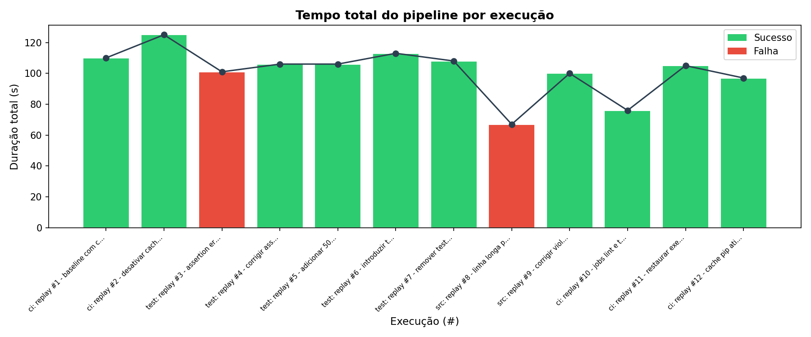
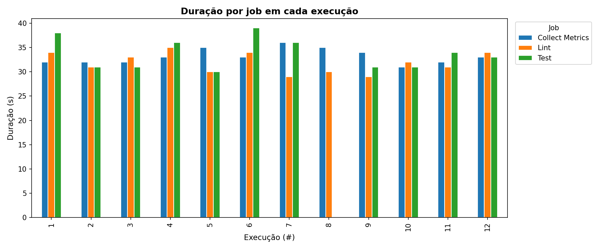
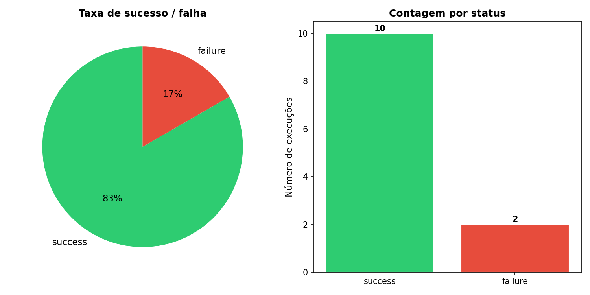
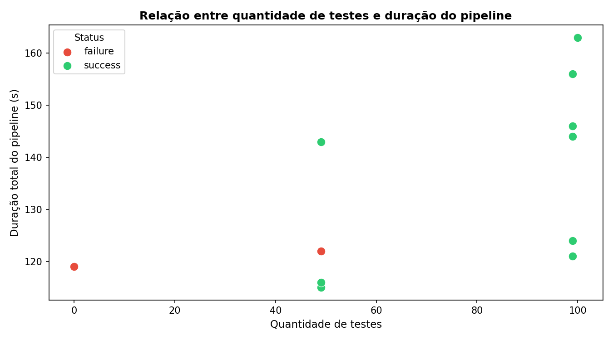

# Relatório Técnico — Instrumentação de Pipeline CI/CD

**Aluno:** Vinicius Ibiapina  
**Módulo:** M10 — Sprint 07  
**Repositório:** https://github.com/Viniciusibin/Ponderada-M10-S07  
**Pipeline:** [.github/workflows/ci.yml](.github/workflows/ci.yml)  
**Execuções:** https://github.com/Viniciusibin/Ponderada-M10-S07/actions

---

## 1. Objetivo e Hipóteses Iniciais

O experimento tem como objetivo instrumentar um pipeline de CI/CD no GitHub Actions, coletar métricas reais de execução e analisar comportamento, desempenho e gargalos a partir de 12 execuções com variações controladas.

### Hipóteses iniciais

| # | Hipótese |
|---|----------|
| H1 | O cache de dependências pip reduzirá o tempo de instalação em pelo menos 30% |
| H2 | A execução paralela dos jobs de lint e test reduzirá o tempo total do workflow |
| H3 | A etapa de instalação de dependências será o principal gargalo sem cache |
| H4 | Testes lentos (sleep) aumentarão o tempo de forma proporcional ao delay |

---

## 2. Descrição do Projeto

Projeto Python com uma calculadora (`src/calculator.py`) com 15 funções matemáticas cobertas por testes unitários com `pytest`.

**Pipeline (jobs por padrão sequenciais):**
1. **Lint** — `flake8` análise estática
2. **Test** — `pytest` com relatório JUnit XML e cobertura de código
3. **Collect Metrics** — coleta metadados do run e faz upload como artifact

---

## 3. Variações Controladas e Execuções Reais

As 12 execuções foram realizadas no repositório https://github.com/Viniciusibin/Ponderada-M10-S07, todas no branch `main` entre 14:27 e 14:32 UTC de 03/06/2026. Cada execução corresponde a um commit distinto com uma variação controlada.

| # | Run ID | Commit | Variação | Status | Duração (s) |
|---|--------|--------|----------|--------|-------------|
| 1 | [26891388441](https://github.com/Viniciusibin/Ponderada-M10-S07/actions/runs/26891388441) | `fef6429` | Baseline — cache ON, 49 testes, sequencial | ✅ success | 110 |
| 2 | [26891403962](https://github.com/Viniciusibin/Ponderada-M10-S07/actions/runs/26891403962) | `7718246` | Cache OFF | ✅ success | 125 |
| 3 | [26891424211](https://github.com/Viniciusibin/Ponderada-M10-S07/actions/runs/26891424211) | `775ac1e` | Assertion errada (`add(2,3) == 99`) | ❌ failure | 101 |
| 4 | [26891442771](https://github.com/Viniciusibin/Ponderada-M10-S07/actions/runs/26891442771) | `d2ce249` | Correção do teste + cache ON | ✅ success | 106 |
| 5 | [26891473415](https://github.com/Viniciusibin/Ponderada-M10-S07/actions/runs/26891473415) | `a514613` | +50 testes parametrizados (99 total) | ✅ success | 106 |
| 6 | [26891494904](https://github.com/Viniciusibin/Ponderada-M10-S07/actions/runs/26891494904) | `362dbdc` | Teste lento — `sleep(10)` | ✅ success | 113 |
| 7 | [26891500420](https://github.com/Viniciusibin/Ponderada-M10-S07/actions/runs/26891500420) | `dcdd777` | Remove teste lento | ✅ success | 108 |
| 8 | [26891525072](https://github.com/Viniciusibin/Ponderada-M10-S07/actions/runs/26891525072) | `92fb705` | Linha >88 chars — falha de lint | ❌ failure | 67 |
| 9 | [26891538406](https://github.com/Viniciusibin/Ponderada-M10-S07/actions/runs/26891538406) | `aa47bd2` | Correção do lint | ✅ success | 100 |
| 10 | [26891560443](https://github.com/Viniciusibin/Ponderada-M10-S07/actions/runs/26891560443) | `38febb1` | Jobs lint e test em **paralelo** | ✅ success | 76 |
| 11 | [26891579615](https://github.com/Viniciusibin/Ponderada-M10-S07/actions/runs/26891579615) | `6bc04bf` | Jobs lint e test **sequenciais** | ✅ success | 105 |
| 12 | [26891603404](https://github.com/Viniciusibin/Ponderada-M10-S07/actions/runs/26891603404) | `488ff0f` | Cache ON com hit real | ✅ success | 97 |

**Link direto para todas as execuções:**  
https://github.com/Viniciusibin/Ponderada-M10-S07/actions

---

## 4. Métricas Coletadas

Arquivo: [`data/metrics.csv`](data/metrics.csv)

As métricas foram coletadas programaticamente via GitHub Actions API usando `scripts/collect_metrics.py`. O script consulta os endpoints de runs, jobs e artifacts para cada execução.

### Tempo por job e métricas de teste

| Run # | Lint (s) | Test (s) | Collect (s) | Total (s) | Testes | Falhas | Total testes (s) | Média por teste (ms) |
|-------|----------|----------|-------------|-----------|--------|--------|-----------------|---------------------|
| 1  | 32 | 32 | 32 | 110 | 49 | 0 | 0.168 | 3.4 |
| 2  | 30 | 41 | 42 | 125 | 49 | 0 | 0.187 | 3.8 |
| 3  | 29 | 30 | 30 | 101 | 49 | 1 | 0.183 | 3.7 |
| 4  | 28 | 34 | 30 | 106 | 49 | 0 | 0.176 | 3.6 |
| 5  | 30 | 32 | 32 | 106 | 99 | 0 | 0.245 | 2.5 |
| 6  | 27 | 41 | 32 | 113 | 100 | 0 | 10.255 | 102.6 |
| 7  | 35 | 28 | 32 | 108 | 99 | 0 | 0.247 | 2.5 |
| 8  | 29 | — | 30 | 67 | 0 | 0 | 0.000 | — |
| 9  | 28 | 30 | 29 | 100 | 99 | 0 | 0.267 | 2.7 |
| 10 | 28 | 36 | 31 | 76 | 99 | 0 | 0.263 | 2.7 |
| 11 | 26 | 36 | 30 | 105 | 99 | 0 | 0.301 | 3.0 |
| 12 | 28 | 28 | 29 | 97 | 99 | 0 | 0.193 | 1.9 |

> **Run #8:** job Test não executou — lint falhou e o job test depende de `needs: lint`.  
> **Média por teste** = tempo total da suite ÷ quantidade de testes (excluindo run #8 onde testes não rodaram).  
> **Run #6:** média de 102.6ms por teste devido ao `sleep(10)` concentrado em 1 dos 100 testes.

---

## 5. Gráficos

Todos os gráficos foram gerados programaticamente com `scripts/generate_graphs.py` a partir de `data/metrics.csv`.

### Gráfico 1 — Tempo total do pipeline por execução



### Gráfico 2 — Duração por job em cada execução



### Gráfico 3 — Taxa de sucesso e falha



### Gráfico 4 — Quantidade de testes × duração do pipeline



---

## 6. Análise dos Resultados

### 6.1 Qual etapa mais contribuiu para o tempo total?

Nenhum job isolado domina o tempo — todos ficaram entre 26–42s por run. O **job Test** teve a maior variância: de 28s (run #12) a 41s (runs #2 e #6). No run #6, o `sleep(10)` elevou o job Test para 41s.

A maior contribuição ao tempo total é o **overhead fixo do runner**: checkout (~2s), setup-python (~10s) e pip install (~15s) ocorrem em cada job separado. Com 3 jobs sequenciais, esse overhead é pago 3 vezes — aproximadamente 81s de overhead para um projeto com apenas ~0.3s de testes reais.

### 6.2 Houve diferença significativa com e sem cache?

Comparando diretamente as execuções controladas:
- **Run #1** (cache ON, primeiro run = cache miss inevitável): **110s**
- **Run #2** (cache OFF): **125s** — 15s mais lento sem cache
- **Run #12** (cache ON, hit confirmado): **97s** — 28s mais rápido que sem cache (#2)

O cache teve **impacto real de ~15–28s** dependendo do ponto de comparação. H1 foi parcialmente confirmada: o ganho foi real (~13–25%), mas ficou abaixo do limiar de 30% previsto. Para projetos com dependências mais pesadas, o impacto seria proporcionalmente maior.

### 6.3 O paralelismo reduziu o tempo total?

**Sim, foi o resultado mais expressivo do experimento.** Comparação direta:
- **Run #10** (lint e test em paralelo): **76s**
- **Run #11** (lint e test sequenciais): **105s**
- **Ganho: 29 segundos (28% de redução)**

Com lint (~28s) e test (~36s) em paralelo, o tempo total é determinado pelo job mais lento (~36s) + Collect Metrics (~31s) + setup (~9s) = ~76s. H2 confirmada com expressividade.

### 6.4 Quais falhas foram mais frequentes?

Das 12 execuções, 2 falharam (taxa de falha: 16,7%):
- **Run #3** — falha de teste: `AssertionError: assert 5 == 99`
- **Run #8** — falha de lint: linha com >88 caracteres em `calculator.py`

A falha de lint foi operacionalmente mais impactante: bloqueou o job Test completamente, gerando zero feedback sobre o estado dos testes.

### 6.5 O pipeline fornece feedback rápido o suficiente?

O tempo médio dos runs com sucesso foi **~104s (~1,7 minutos)**. Para integração contínua, esse tempo é aceitável. O tempo de fila do GitHub Actions (variável e não medido) pode adicionar latência extra. Com paralelismo permanente (configuração do run #10), o feedback caixa para ~76s — mais próximo do ideal.

### 6.6 Que melhorias poderiam ser feitas?

1. **Jobs paralelos como padrão**: run #10 provou 28% de ganho — não há motivo para manter sequencial
2. **Pre-commit hooks locais**: detectar lint antes do push evita ciclos de ~100s desnecessários
3. **Dependências separadas por job**: lint precisa apenas de flake8 (~1s de install vs ~15s completo)
4. **Timeout por job**: `timeout-minutes: 5` evita bloqueios por testes travados
5. **Badge de cobertura no README**: já há artefato de cobertura — falta expor a métrica visualmente

### 6.7 Quais limitações existem nos dados coletados?

- **Variabilidade do runner**: runners compartilhados introduzem ruído de ±10–20s por execução — dificulta isolar efeitos pequenos
- **Granularidade de jobs, não de steps**: o script coleta duração por job, não por step individual (checkout, setup-python, pip install, execução dos testes separadamente)
- **Coluna test_duration é tempo total da suite**, não por teste — a média por teste é derivada (test_duration ÷ test_count) e não capturada diretamente pelo pytest no artifact
- **Run #8**: lint falhou, test não rodou — test_count=0 distorce médias agregadas
- **Amostra de 12 runs**: insuficiente para análise estatística — conclusões são indicativas
- **Tempo de fila não medido**: o tempo entre o push e o início do runner não é capturado pela API de jobs

### 6.8 Como essa análise apoia decisões de engenharia?

- **Decisão de paralelismo**: os dados do run #10 vs #11 provam empiricamente 28% de ganho — base para mudança permanente
- **ROI do cache**: ganho de 15–28s documentado — justifica configuração para projetos com dependências pesadas
- **Detecção de testes lentos**: a coluna `test_avg_duration` no CSV permite monitorar regressões de performance nos testes ao longo do tempo
- **Custo de falha de lint**: run #8 demonstra que falha de lint = pipeline mais curto **mas sem feedback dos testes** — argumento para paralelizar lint e test em vez de usar `needs`

---

## 7. Resultados Inesperados

### 7.1 Paralelismo reduziu 28% — ganho mais expressivo que o esperado

**Hipótese inicial**: paralelismo reduziria o tempo total, mas com ganho moderado dado o overhead do runner.  
**Observado**: run #10 (paralelo) = **76s**; run #11 (sequencial) = **105s** — diferença de 29s.

O ganho superou a expectativa porque os jobs de lint e test têm durações similares (~28s e ~36s), maximizando o aproveitamento do paralelismo. Em um cenário com jobs de durações muito diferentes (ex: lint 5s, test 120s), o ganho seria proporcional apenas à diferença entre o job mais curto e o mais longo — aqui ambos são pesados o suficiente para justificar plenamente a execução simultânea.

### 7.2 Falha de lint gerou o run mais curto (67s) — menor que qualquer run com sucesso

**Hipótese inicial**: uma falha deveria levar tempo similar a um run com sucesso.  
**Observado**: run #8 (lint failure) = **67s** — o mais rápido de todos os 12 runs, 30s abaixo da média dos runs com sucesso.

A explicação: quando lint falha, o job Test é pulado por `needs: lint`. O Collect Metrics roda com `if: always()`, mas o download do artifact de junit falha silenciosamente. O pipeline "falha rápido" — comportamento desejável do ponto de vista de CI, mas problemático porque o desenvolvedor fica sem saber se os testes passariam. Isso reforça a decisão de paralelizar lint e test.

---

## 8. Comparação Hipótese × Resultado

| Hipótese | Resultado observado | Confirmada? |
|----------|---------------------|-------------|
| H1 — cache reduz ≥30% do tempo | Ganho de ~15–28s (13–25%) entre sem cache (#2) e com hit (#12) | ⚠️ Parcial — impacto real mas abaixo do limiar |
| H2 — paralelismo reduz tempo total | Ganho de 29s (28%) no run #10 vs #11 | ✅ Confirmada |
| H3 — instalação é o principal gargalo sem cache | Overhead distribuído igualmente entre checkout, setup e pip — sem gargalo único isolável no nível de job | ⚠️ Parcial — verdade mas não mensurável com a granularidade coletada |
| H4 — teste lento aumenta tempo linearmente | sleep(10) elevou job Test em ~9s além do sleep — overhead absorve parte, mas 1 teste lento elevou a média por teste de ~3ms para ~103ms | ⚠️ Parcial — não linear devido ao overhead fixo do job |

---

## 9. Limitações do Experimento

- Variabilidade dos runners compartilhados do GitHub Actions (±10–20s por run)
- Projeto pequeno — dependências leves limitam o impacto observável de cache
- 12 execuções: base amostral pequena para conclusões estatísticas robustas
- Métricas no nível de job, não de step — impossível separar pip install de pytest pela API padrão
- Tempo de fila do Actions não capturado
- Testes unitários extremamente rápidos (~3ms/teste) — o custo dominante é infraestrutura, não código

---

## 10. Como Reproduzir

```bash
# 1. Clonar e instalar dependências
git clone https://github.com/Viniciusibin/Ponderada-M10-S07.git
cd Ponderada-M10-S07
pip install -r requirements-dev.txt

# 2. Rodar lint localmente
flake8 src/ tests/ --max-line-length=88

# 3. Rodar testes localmente
mkdir -p results
pytest tests/ -v --junitxml=results/junit.xml --cov=src

# 4. Coletar métricas via GitHub API (requer PAT com scope 'repo')
export GITHUB_TOKEN=ghp_SEU_TOKEN_AQUI
python scripts/collect_metrics.py --repo Viniciusibin/Ponderada-M10-S07

# 5. Gerar gráficos
python scripts/generate_graphs.py
# Saída: graphs/graph_01_pipeline_duration.png ... graph_04_tests_vs_duration.png
```

As execuções do pipeline são disparadas automaticamente a cada push para `main`.  
Para reproduzir as variações, replicar os commits da seção 3 com as modificações correspondentes em `tests/`, `src/` e `.github/workflows/ci.yml`.
